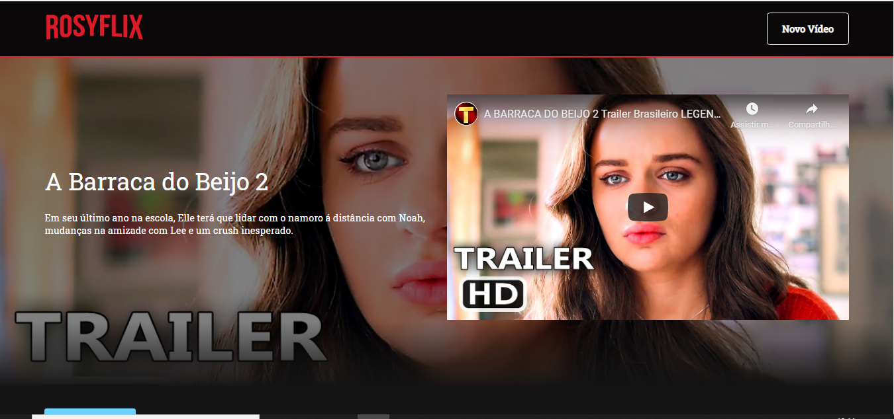

<h1 align='center'>RosyFlix</h1>

<h3>🔖 Description</h3>

The #ImersãoReact week consists of building a web application with React from scratch!

<h5>5 exclusive, brand-new classes, building AluraFlix.</h5>

<h3>🚀 Technologies</h3>
<ul>
    <li><a href="https://reactjs.org/" target="_blank">React</a></li>
    <li><a href="https://reactrouter.com/" target="_blank">React Router</a></li>
    <li><a href="https://react-slick.neostack.com/" target="_blank">React Slick</a></li>
</ul>

<h3>ℹ️ How to use</h3>

    # Clone this repository
    $ git clone https://github.com/RosyProgramming/RosyFlix.git
    
    # Install dependencies
    $ npm install
    
    # Run
    $ npm start

<h3>🖼 Layout</h3>

